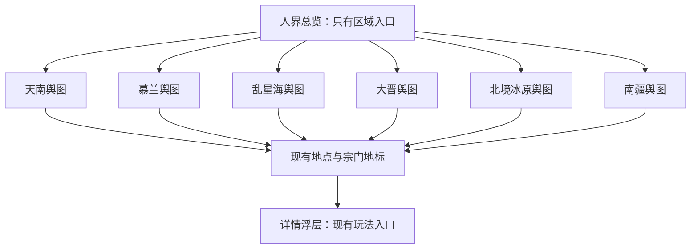

# 双层水墨地图与 Phaser 4 改版方案

日期：2026-09-19。状态：总览及天南、乱星海、慕兰、大晋、南疆、北境冰原六张二级地图已接入，覆盖全部 66 个现有地点。

素材进度：世界总览及六张区域底画已接入 `/game/map-v2`，见[素材交付清单](game-map-art.md)。二级地图采用独立区域构图。美术规范统一维护在[国画水墨地图 skill](../.agents/skills/daoyou-map-art/SKILL.md)。

## 1. 目标与假设

Phaser 4 地图现作为统一地图入口；原 DOM 实现及专属组件已删除，旧 `/game/map` 地址兼容跳转到 `/game/map-v2`，不再展示旧版入口。新地图由人界总览、区域舆图两层组成；总览仅提供区域入口，具体地点放在区域舆图。节点详情是交互浮层，不是第三层地图。

本方案将“节点暂时不变”解释为保留节点 ID、名称、类型、归属关系、玩法配置及原有连接数据，只为新版配置新坐标。首期不新增旅行时间、移动消耗、角色地理位置、道路通行限制或探索解锁规则。浏览区域不产生角色状态变更。

最新范围调整：南疆与北境冰原各自提升为独立二级地图，其主节点、附属地点及宗门随地域拆分。这里改变的是新版展示归区；节点 ID、parent_id 和业务 region 保持不变。六区入口和展示归属配置已实施，大晋底画包含拆分后保留的 20 个地点。

两张参考图提供地理构成和层次表达依据，其中的标签、字幕、水印不构成实施指令。图一用于大陆、海域、草原的相对位置；图二用于区域山川、聚落和势力腹地的组织方式。新素材重新创作，不直接描摹参考图的底画、旗标或纹理。

## 2. 当前代码事实与可行性

- `package.json`、本地 `node_modules/phaser/package.json` 均已有 Phaser 4.2.1；本次查询 npm latest 也为 4.2.1，无需为地图先升级引擎。
- 宗门清扫与采掘已有 Phaser runtime，可参考 React 挂载、回调、销毁及错误反馈的接入方式。地图应独立实现相机与输入，不直接复制小游戏固定画幅、横屏或摇杆方案。
- 改造前的旧地图位于 `src/react-app/routes/game/map/route.tsx`（现已删除），使用 `react-zoom-pan-pinch`、DOM 节点和 SVG 连线，地图尺寸 3056×2143，初始视角含固定偏移，边界限制关闭。
- 地图数据来自 `src/shared/data/map.json`，经 `src/shared/lib/game/mapSystem.ts` 读取。共有 20 个主节点、41 个附属节点、5 个宗门地标，共 66 个可定位对象。
- `/game/map` 使用沉浸式 `GameMapLayout`，不属于普通 `GameViewportLayout` 正文；应保留地图沉浸壳，不套入主流程卡片页。
- `nodeId` 支持节点直达，`intent=market|dungeon|sect` 保留不同选址语义。野外、历练、坊市和宗门依赖稳定 ID，需要继续共用现有动作规则。
- 当前地图连接的可见消费者主要是地图连线，不能把示意连线直接升级成服务端旅行规则。部分跨区连接是单向配置，不应自动补反向连接。

技术可行性高，业务迁移风险可控；主要工作量是地理构图、美术生产、手机交互、资源加载和新旧入口衔接。66 个对象本身不足以证明 DOM 就是性能瓶颈。Phaser 有利于统一相机、命中、分层与动效，但是否更流畅、是否更省电必须实测。

## 3. 地图层级与地理设计

以下为当前六区展示归属，附属节点和宗门地标随其主节点归区；南疆与北境的业务 region 仍为大晋，新版展示归区独立：

| 二级地图 | 主节点 | 附属节点 | 宗门地标 | 合计 | 构图建议 |
| --- | ---: | ---: | ---: | ---: | --- |
| 天南 | 7 | 15 | 1 | 23 | 东南陆地，山岭、河谷、国境与聚落相间；作为首张样板 |
| 慕兰 | 1 | 3 | 0 | 4 | 天南以北的草原过渡地带；采用更紧凑画幅，不为填满画面新增节点 |
| 乱星海 | 4 | 7 | 0 | 11 | 总览中位于大陆西南侧海域，二级图突出岛链、内外海与岛群疏密 |
| 大晋皇朝 | 6 | 11 | 3 | 20 | 皇朝腹地、晋京、昆吾山及偏远裂渊、冥海、天关、雷狱；不包含南疆或冰原 |
| 北境冰原 | 1 | 2 | 0 | 3 | 北夜小极宫、万年玄冰库、玄冰藏经窟独立成图 |
| 南疆 | 1 | 3 | 1 | 5 | 十万大山、无名古墓、独木成林、不见天与无相禅宗独立成图 |
| 总计 | 20 | 41 | 5 | 66 | 全量覆盖现有对象 |

总览保留参考图中“北部大晋、东侧陆带、东南天南、西南岛海”的主要空间关系；海域用留白、淡青灰与少量水纹，帮助辨认陆海而不是铺满装饰。

北境冰原与南疆已在总览的大晋北缘、南缘设置独立标记，使用现有总览底画上的雪山与南部山地作为锚点。两区均已开放，分别接入独立底画和 3 个、5 个地点锚点；北境首次进入以北夜小极宫为镜头中心。

一级地图展示 12 个地域名称：天南、慕兰草原、乱星海、大晋皇朝、南疆、北境冰原、天澜草原、天沙大陆、五龙海、无边海、极西之地、飓风沙漠。前六区已开放；其余六区以淡墨标注“未开放”，不显示进入箭头、不响应区域进入。极西之地和飓风沙漠按参考图相对方位暂定展示锚点，不定义玩法边界。名称调整不改变已有节点的业务地域和归属。

查找列表同步禁用未开放区域及其地点。显式访问未开放区域 URL 时仍显示总览底画和未开放提示，只提供返回人界操作。旧版地址保留参数并跳转新版。图二的正道、魔道等势力分区仅作视觉参考，本期不新增势力入口、阵营控制、通行或收益规则。

大晋现有高阶裂渊、冥海、天关、雷狱等地点继续归入大晋，可沿偏远山地与边缘险境布局。先通过局部雾气和地貌表达距离感，无需为它们增加第三层地图。

### 两层各自显示什么

- 总览：大陆与海域、山系大势、12 个地域标记，其中 6 个开放区域提供进入箭头。当前通过题签点击进入，地域轮廓命中待实现；不画具体地点、宗门节点或节点关系网。
- 区域舆图：默认绘制全部地点图标，不再按缩放隐藏附属节点；短名称优先避让，拥挤时仅收起部分名称，图标仍可点击。选中名称完整显示。
- 用途筛选：灵兽出没地、秘境、坊市、宗门、山川地标，每个节点仅归入一种用途，多选筛选仍按并集显示。
- 节点选中：朱砂描边与完整名称置顶，只展示一个非模态节点面板，集中呈现地点说明、用途信息与唯一玩法入口，可继续拖动或选择其他节点。新版地图不绘制节点连线，也不展示跨区域连接提示；区域切换通过总览入口完成。

## 4. 交互方案

首次从新版普通入口打开人界总览。返回地图时恢复上次浏览区域与镜头；有 `nodeId` 的显式链接优先定位该节点所属区域。镜头状态不是角色当前位置，不显示虚构的“你在这里”。

- 桌面：拖拽平移，滚轮围绕指针缩放，点击区域进入二级图，点击节点打开统一信息与操作面板。
- 手机：单指拖动、双指围绕手势中心缩放；拖动和缩放结束不能误触节点。主要命中区按屏幕像素保持至少约 44px，密集处由标签避让处理，重叠命中时弹出地点选择列表。
- 层级切换必须由明确点击触发，首期不让滚轮或捏合自动跨层，以免意外返回。
- “人界 / 当前区域”、查找地点与版本切换入口叠在地图上，不再提供缩放和回到全图按钮。移动端控件避让安全区，详情打开时屏蔽画布输入。
- 地点查找按原有名称工作，可跨区域定位；同一列表也提供键盘和读屏可操作的入口，避免 Canvas 成为唯一入口。
- 地图铺满整个视口，最小缩放保证不露出画布边缘；窄屏通过拖动查看裁切的两侧。相机在每张图的有效边界内移动。详情面板占用空间应计入定位，不能把选中节点移到抽屉下面。
- 层级过渡用约 250–400ms 的轻微拉近、淡入淡出，支持减少动态效果；不以复杂墨液 shader 作为首期依赖。

“返回人界”与“关闭地图”是不同操作：前者只切换层级；后者沿用现有关闭地图语义。浏览器前进、后退需要正确恢复层级和选择，不为每一次拖动写历史记录。

## 5. 正式入口与技术结构

### 路由和迁移

- 正式入口为 `/game/map-v2`，统一使用 `map` 场景登记。`/game/map` 仅保留 replace 重定向并完整保留查询参数，不加载旧组件，也不登记独立场景。
- 区域 ID 由 `ATLAS_REGIONS` 定义，通过 `region` 查询参数表达；实际开放状态由 `hasAtlasMap` 判断。有效 `nodeId` 的归属优先于冲突的 `region`。
- 内部入口和玩法返回链接均直达正式地图。`intent` 继续作为选址筛选提示，`types` 保存多选类型；进入玩法时以历史项 `mapReturnTo` 保存来源，返回解析同时兼容旧地址和正式地址，保留区域、类型和节点。
- 不再提供版本切换、版本偏好或旧版故障回退。加载失败提供重试，关闭地图固定返回洞府。

### React 与 Phaser 分工

React 负责沉浸壳、URL、玩家资源、搜索、详情抽屉与玩法跳转。Phaser 负责地形、节点图形、标签、命中、相机、裁剪与轻量动效。节点信息与操作由 `AtlasNodePanel` 统一展示，复用 `WildNodePreview`；共享 feature 中的 `mapActions.ts` 提供玩法动作和 `MapNodeAction` 类型。旧版详情组件已删除。

一个地图页面生命周期只创建一个 `Phaser.Game`。当前样板使用一个可切换视图的 Scene，共用相机与输入逻辑；总览和区域分别加载独立底画与标记。后续只有生命周期出现实际差异时再拆 Scene。React 只在选区、选点等离散事件更新状态，不逐帧同步相机坐标。

引擎仅在新版路由中按需加载；使用已有 Phaser 版本与熟悉 API，不假设 WebGPU 或套用旧 Phaser 3 自定义 pipeline。退出页面销毁 Game、监听与纹理资源，处理 React 开发模式重复挂载、resize、后台暂停和 WebGL 上下文恢复失败。

### 数据分层

| 数据 | 首期处理 |
| --- | --- |
| `src/shared/data/map.json` | 继续作为节点玩法事实来源，保留旧 x/y，原版外观不受影响 |
| 新的区域展示配置 | 保存 region ID、显示名、总览锚点/轮廓、资源键、区域画幅及默认镜头 |
| 新的节点展示配置 | 以现有地点 ID 为键，保存区域内归一化坐标、标签偏移和显示优先级 |
| 图像与标记资源 | 按世界/区域组织底图；可复用 UI 图标继续走集中图标注册 |
| 浏览状态 | 本地记忆最后区域和镜头；显式 URL 参数优先，不新增角色持久化字段 |

`displayRegionId` 是展示维度，不修改节点原有业务 `region`。附属节点、宗门的区域按 parent_id 推导并校验。美术换尺寸后归一化坐标仍可沿用；实际地貌重新构图时必须重新核对锚点。

首期预计无需数据库迁移、额外地图 API 或新服务端玩法。后端仍通过原入口和原规则执行资格、成本、战斗与资源校验。

Canvas 内可用程序几何绘制简单交互标记；需要复用现有图标时，从集中 registry 增加最小纹理适配入口，不能让业务配置自行解析 `icon:` 或复制路径表。React UI 仍统一使用 `GameIcon`。山川底图属于场景素材，不伪装成 UI 图标。

## 6. 美术生产方案

笔墨、彩墨、地域特色、层级构图与美术验收统一遵循[国画水墨地图 skill](../.agents/skills/daoyou-map-art/SKILL.md)，本文不维护另一套风格规则。已交付素材见[地图素材清单](game-map-art.md)。

总览及六张有现有地点的二级地图均已完成美术接入。后续专注其余地域设计与素材质量，不再安排浏览器验收。区域图独立构图，不能用总览坐标直接换算内部地点；地理关系与河流连贯性仍需检查。

现规划为一张世界底画与六张区域底画，额外地标纹理或效果层按实际需要制作。其余区域按各区设定重新构思。文字和交互状态由运行时独立绘制，节点标签保持小字号可读性。

## 7. 加载、性能与风险

- 首次仅加载总览及基础 UI，进入区域再加载对应资源；不一次常驻全部高清区域。
- 初期优先较低分辨率预览与单张区域纹理。在样板测试证明存在纹理上限或内存压力后，再对大图分块；不要先建设通用无限地图/瓦片编辑器。
- 4096×4096 RGBA 纹理单层约 64 MiB，8192×8192 约 256 MiB，尚未计算 mipmap、解码副本、帧缓冲等。WebP 文件压缩率不能代表显存开销。
- 实测设备最大纹理尺寸，限制设备像素比和同时常驻区域数量。使用透明图层时检查边缘、接缝和混合模式；减少全屏滤镜与持续粒子。
- 只在必要时重建标签纹理；实现标签优先级与避让，保持全部图标可见，避免把 DOM 节点拥挤原样搬入 Canvas。
- 字体就绪后生成中文标签，避免异步字体导致字形错位；持续动效在页面隐藏时停止，减少动态模式保持静态。
- 画布按设备像素比（最高 3 倍）创建实际像素尺寸，再以 CSS 尺寸显示；文字纹理使用同一倍率。标签排版、控件避让和点击区域仍按 CSS 像素计算，相机与指针显式换算，文字投影后对齐实际像素。窗口变化时同步更新画布和文字精度，镜头快照保存与像素密度无关的缩放值。
- 加载失败显示重试；快速切区时旧请求完成不能覆盖新选择。限制缓存并在退出时释放，不能只隐藏旧 Scene。

以下是建议验收目标，尚非已测结果：

| 维度 | 建议目标/方法 |
| --- | --- |
| 正确性 | 66 个对象全覆盖且唯一归属，玩法 ID 和动作与旧版一致 |
| 手机操作 | 360px 竖屏可找到区域和地点；捏合、拖动结束无误选，详情不遮住目标 |
| 帧率 | 在约定中端真机上拖拽目标 55–60 FPS，低性能档至少稳定 30 FPS；同时记录帧时间与长任务 |
| 首次加载 | 普通网络下尽快呈现可交互低清总览；先以冷缓存 Fast 4G、约定设备 3 秒为样板目标，按资源实测校准 |
| 资源 | DevTools 检查切换区域和退出后的资源释放，连续进入/退出十次无持续增长 |
| 恢复 | 刷新、前进后退、旧地址重定向、进入玩法再返回，保留正确区域、节点和选址 intent |
| 回退 | 素材加载失败可重试，关闭地图可回到洞府 |

旧版已下线，历史性能基线仅供参考。浏览器模拟手机视口不能替代 iOS Safari、Android 真机的 GPU、内存与触摸验证。

## 8. 实施阶段与退出条件

下列保留原四区方案的阶段与工时估算，不是交付承诺。新增南疆、北境作为 P3 的延展，工期尚未重估；当前用户要求后续接入不做浏览器验收，以下原有浏览器及真机退出条件不作为后续地图设计交付的前置要求。

| 阶段 | 交付 | 验收后进入下一阶段 | 粗估工作日 |
| --- | --- | --- | ---: |
| P0 地理和交互定稿 | 四区域归属表、世界/天南灰稿、路由与回程约定、旧版基线 | 66 个对象归属完整，世界方位和天南落点可评审 | 1–2 |
| P1 技术样板 | 独立新版路由、总览到天南、平移缩放、节点详情、旧版切换；可用占位地形 | 手机能操作，现有玩法能进入并返回，镜头和生命周期可靠 | 2–3 |
| P2 美术样板 | 正式总览与天南底画、标签层级、命中区与过渡动效 | 在实际页面验收美术及性能，确定其他区域制作规范 | 3–5 |
| P3 全区域接入 | 慕兰、乱星海、大晋底画与全部节点锚点、按区加载、地点查找 | 全部对象和入口一致，跨区直达与返回正确 | 4–6 |
| P4 并存体验版 | 明确新版入口、版本偏好与回程接入、失败回退、桌面/真机验证 | 静态检查通过，旧版无回归，关键设备无阻断问题 | 2–4 |

合计约 12–20 个工作日。P1 验证技术与交互，P2 是首个可评审的完整体验切片；在 P2 验收前不要批量制作剩余区域美术。首次公开体验应在四区覆盖之后，避免玩家切入新版后找不到已有内容。

上述为最初阶段规划。2026-09-20 已完成旧版代码下线，当前入口与兼容策略以第 5 节和下线记录为准。

## 9. 验证安排与原始方案编写范围

后续按用户要求不再进行浏览器验收。仅美术交付检查画面、缩小效果、解码、尺寸与压缩质量；代码接入时通过代码检查核对区域归属、直达、版本切换及玩法入口，并运行 `bun run lint`、相关 `bun run test`、`bun run build`。纯共享区域归属、ID 覆盖、坐标范围等确定性逻辑允许在 `src/shared` 添加测试；不在 React、服务端或 scripts 下增加测试框架。下文浏览器结果是历史样板验证记录，不表示后续素材已做页面验收。

本次仅新增本方案文档。已执行 `git status --short`、`rg` 定位与代码读取、Python 只读地图统计，以及 npm registry 版本查询；没有安装依赖、修改业务代码、生成正式美术、启动应用或修改数据库。文档检查采用 `git diff --check` 与内容审阅。未运行 lint、单元测试、构建或浏览器性能测试，因为本次没有运行时代码变更；本文不构成性能通过或兼容性通过报告。

## 10. P1 技术样板接入记录（2026-09-19，历史记录）

以下记录当时的并存阶段和验证结果，不代表当前仍提供旧版入口。

已实现：

- `/game/map-v2` 与原版并存，沉浸壳、场景注册、标题上下文与关闭行为已接通。
- 世界总览显示 12 个地域标记；天南、乱星海、慕兰草原、大晋皇朝、南疆、北境冰原使用独立底画，分别重新锚定现有 23 个、11 个、4 个、20 个、5 个、3 个地点。乱星海、大晋、北境冰原首次进入分别以天星城、晋京、北夜小极宫为镜头中心，开放区域支持区域入口、地点直达、筛选及新旧版切换。其余无二级图区域统一标记“未开放”。
- 鼠标拖动、滚轮围绕指针缩放、相机边界与视口变化适配；地图铺满视口，操作 UI 以浮层展示。双指缩放已实现，尚待真机验证。
- 节点默认全显，五类单一用途使用独立彩墨剪影图标；命中区与字形保持屏幕尺寸。标签避让，选中时完整名称置顶，统一节点面板不阻断地图手势，查找抽屉打开时阻止画布响应。名称未烘焙进底画。
- React 搜索列表覆盖现有全部地点，支持键盘操作与跨区域定位。详情、玩法动作与旧版共用。
- 两版详情和页面均有版本切换入口，保留当前节点与 intent。坊市切层保存来源；野外、历练重选、访宗可直接返回新版。来源只随当前玩法历史项传递，不是跨整个游戏的永久版本偏好。
- 显式节点归属优先于冲突 region；无效参数显示可用地图和提示。新版“关闭地图”固定回洞府，避免把内部区域浏览历史当成外部关闭目标。
- 引擎按路由动态加载，背景按访问层级加载，两个纹理最多约 12 MiB 原始 RGBA 数据（不含解码副本、标签和帧缓冲）。退出销毁 Game 与监听，仅保留当前页会话中的两个镜头快照；刷新不保证保留镜头。

验证使用专用本地环境 `127.0.0.1:5174`，复用本地测试账号，未启动战斗、购买物品或调整角色数据。通过代码检查、`bun run lint`、`bun run build`，以及 `bun run test src/shared/lib/game/mapAtlas.test.ts src/shared/lib/game/mapSystem.test.ts`（15 项通过）。构建保留现有大包体及不生效动态导入的提示，无构建错误。

浏览器已核对 1366×900 桌面和 360×800 窄屏、画布区域点击、拖动不误选、节点搜索、四种 intent、冲突/无效参数、新旧版保留节点切换、其他区域回退、坊市/野外/历练/访宗入口与直接回程、前进后退层级恢复。检查时画布在新版为一个、退出旧版后为零，控制台未见地图错误。

未完成的后续验收：真实多点触摸（当前内置浏览器不支持触摸注入）、iOS/Android 真机表现、帧率/显存/冷加载定量对照、连续十次进出内存检测、断网及 WebGL 上下文丢失恢复。代码中已有加载失败重试与旧版入口，但不将其等同于故障恢复已通过验收。此阶段不表示 P4 已完成。

尚未实施：其余六个未开放地域的二级地图设计；全局默认版本偏好、地域轮廓命中、切图动效及完整性能验收。一级地图已标记全部 12 个已知地域，按二级图接入情况开放进入，不制作节点连线或跨区航路。

### 节点用途与交互更新

- 全部 66 个节点各自只承担一种职责：10 个灵兽出没地、31 个秘境、7 个坊市、5 个宗门、13 个山川地标。青溪坡保留原 ID 和野外关联，取消 dungeon_config 及秘境描述；服务器现有秘境准入检查也会拒绝该地点的新副本请求。城区中的交易地点统一归为坊市，不再双重分类。地理节点仅提供地点信息。
- 五类图标使用图片生成的国画彩墨素材，分别表现灵兽、石门、摊亭、山门和山川，无多用途徽记。透明母版分割与裁切后交付为 160×160 无损 WebP，统一注册于 icons/registry.ts；React 与 Phaser 共用 GameIcon 的资源解析，区域地图使用左大右小的一体胶囊标签，图标固定在左侧徽头，右侧文字胶囊低 16px；徽头最小高度 52px，图标通常为 40px，秘境菱徽内为 32px。五类节点同时通过图标、低饱和彩墨底色和徽头轮廓区分：灵兽苔绿圆形、秘境烟紫菱形、坊市赭金圆角方形、宗门青碧六角形、山川石青拱形。整张胶囊共用命中区，选中使用朱砂描边和完整名称。避让时保持图标在左，仅小幅上下移动整张胶囊；密集处保留有类别颜色和轮廓的徽头，悬停或选中时展开完整名称。
- 地图默认全部显示；types 保存多选筛选，旧 intent 在没有 types 时提供初始用途。每个节点只命中一种筛选。世界总览不受用途筛选影响，返回和切区保留 types；旧 city 筛选已退役，单独传入时安全回到全部。
- 左上角并列“关闭地图”和“返回上层”，关闭返回洞府，上层返回人界总览。右上角采用按内容收紧的单行工具条，直接展示区域名、“搜索地点”输入框和“全部类型／类型数量”下拉按钮，查找与筛选均在工具条下方就地展开；移除底部操作条及所有旧版切换／错误回退入口。
- 全局地图入口统一到新版。旧 `/game/map` 地址只作兼容重定向，保留 nodeId、intent 等参数，用 replace 避免返回历史再次进入旧地址。
- 节点只保留一个非模态信息与操作面板，包含名称、类型、描述、境界／难度／奖励或灵兽预览，以及唯一玩法操作；不再有“详情”按钮或第二个节点抽屉。信息较长时正文滚动，操作保持可见。宗门节点只保留进入本宗或拜访山门入口。
- 控件高度与节点标签避让由实际矩形测量；顶部较窄时可换行，面板和筛选随顶部高度向下调整。选中、悬停、键盘导航与重叠地点选择继续保留。
- 验证采用 lint、客户端／服务端构建、地图归属／分类／规则及野外配置共享测试；透明 WebP 已检查独立画面和地图背景上的缩小效果。按约定不进行浏览器或真机验收，不将静态检查等同于触摸与性能实测。

- 工具条按钮具有悬停、按下、键盘聚焦反馈，筛选展开使用深墨底，已选类型有勾选框与数量。取消原查找抽屉，搜索输入后即显示结果，支持方向键选项、Escape 或外部点击收起；菜单不阻断地图拖动。

## 12. 旧版地图下线（2026-09-20）

- 删除旧 DOM 地图页面、三类 DOM 节点、两类旧详情、组件导出入口和 `.bgi-map` 远程底图样式；未删除远程 OSS 文件。
- 共享动作类型迁入 `mapActions.ts`，清除旧版 intent 动作分支与新版原本过滤的宗门介绍动作。`intent` 的筛选含义仍保留。
- 移除旧地图关闭历史回退逻辑；布局顶栏收敛为 `SectVisitSceneChrome`，保留访宗页面的返回操作。
- 地点数据仅移除旧画布坐标 `x/y` 和连线 `connections`，同时收敛类型、测试样例及秘境服务兜底对象。地点 ID、归属和玩法配置保持不变，Phaser 锚点仍由 `mapAtlas.ts` 管理。
- 保留 `mapSystem.ts`、`map.json`、`WildNodePreview`、正式地图与全部正式美术资源。宗门内部 `SectMap` 仍使用 `react-zoom-pan-pinch`，因此保留依赖及锁文件。

验证：`bun run lint`、`bun run build`（客户端与服务端）通过；`bun run test src/shared/lib/game/mapAtlas.test.ts src/shared/lib/game/mapAtlasCategories.test.ts src/shared/lib/game/mapSystem.test.ts src/shared/engine/combat-v6/wild/pack.test.ts` 共 40 项通过。结构化比对确认全部 66 个地点的玩法数据未改变，仅删除旧坐标和连线；源码扫描确认旧组件和旧底图引用已清除，任务服务生成的链接也已迁移。按用户此前约定，本轮未执行浏览器或真机验收；构建仍有既有大包体及无效动态导入提示。

## 13. 文字级联地图（2026-09-20）

- `/game/map-v2` 同时提供「画卷 / 文字」显示模式；这不是恢复已下线的旧 DOM 地图。
- 文字模式按「区域 → 地点类型 → 地点」浏览，桌面分栏、移动端逐级进入；类型默认展开，可折叠，未开放区域只展示名称。
- 两种模式共享区域/节点数据、类型筛选、搜索、URL 选择状态和 `AtlasNodePanel` 操作入口。切换模式不修改区域、节点和类型参数；玩法返回继续沿用 `mapReturnTo`。
- 文字模式不初始化 Phaser；切离画卷会销毁引擎实例。地图工具栏和系统设置的「游戏设置」均可切换显示模式。
- 浏览器普通展示偏好统一从 `src/react-app/lib/game-setting.ts` 读取及更新，localStorage key 为 `game-setting`。当前结构：`{"version":1,"mapMode":"atlas"}`，`mapMode` 可为 `atlas` 或 `text`，默认画卷。
- 配置属于当前浏览器，同浏览器账号共用；支持同页面订阅与跨标签页同步。损坏/不支持的配置使用默认值；存储不可用时保留本次会话中的选择。
- 后续普通本地偏好扩展 `GameSettings`、默认值、解析与变更比较，禁止业务组件直接读写该 key。凭据（如模型 API Key）、服务器角色设置及临时玩法状态不并入展示偏好。

### 移动端地图工具栏

- 小于 768px 时采用同一行的左右独立悬浮面板：左侧仅关闭与返回上层（区域内）图标，两者之间保留分隔线；右侧按内容宽度放区域名、查找、更多，中间留出地图。区域名称可省略，按钮点击区域至少 44px。
- 「查找」打开最高 70dvh 的底部抽屉，合并地点搜索、类型多选和结果列表；结果独立滚动，选中地点后沿用原逻辑收起查找并显示详情。
- 顶栏以小圆点提示已启用类型筛选；「更多」提供画卷/文字切换，继续使用统一浏览器偏好。
- 抽屉复用 `InkDetailDrawer` 的遮罩、焦点管理、Escape 关闭与安全区处理；桌面保留原来的导航面板和搜索筛选面板。
